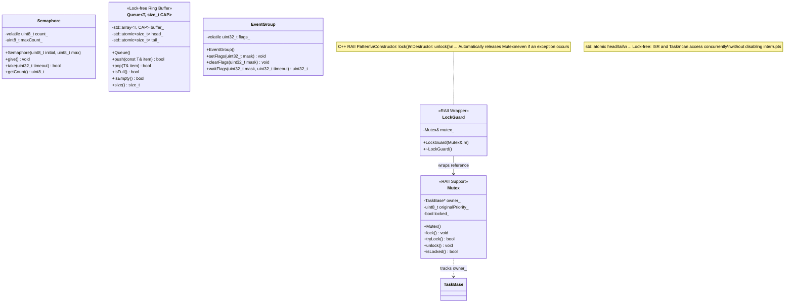
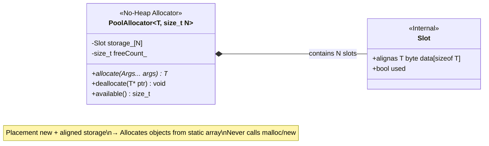
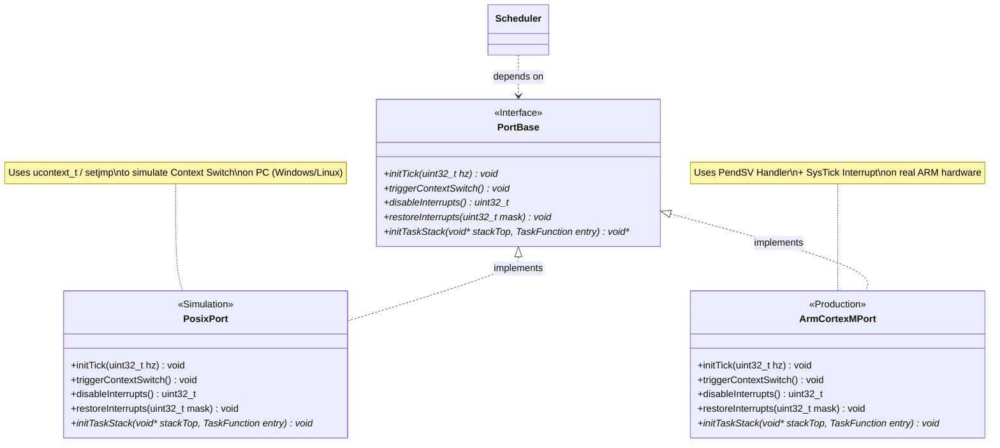
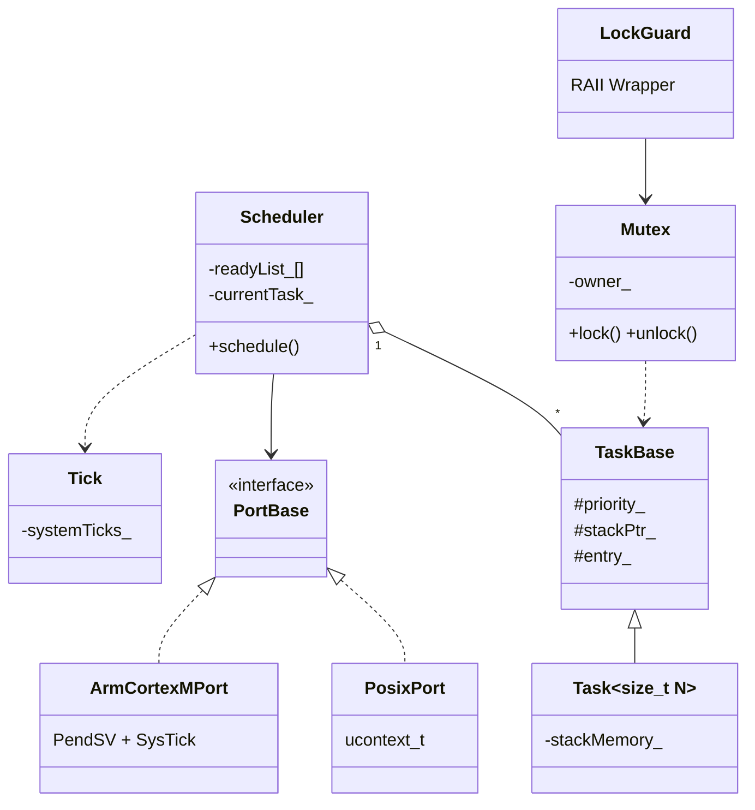

# 📐 LooRTOS — Class Diagram

> Class diagrams describe the **static structure** of the system: classes, attributes,  
> methods, and the inheritance / composition relationships between them.

---

## 1. Kernel Core — Central Brain

> The most critical group of classes, determining how Tasks are created,  
> queued, and executed by the CPU.

```mermaid
classDiagram
    direction TB

    class TaskBase {
        <<Abstract Base>>
        #uint8_t priority_
        #void* stackPtr_
        #TaskBase* next_
        #TaskFunction entry_
        -volatile State currentState_
        +TaskBase(TaskFunction entry, uint8_t priority)
        +~TaskBase()
        +getState() State
        +setState(State s) void
        +getPriority() uint8_t
        +run() void
    }

    class State {
        <<enumeration>>
        READY
        RUNNING
        BLOCKED
        SUSPENDED
    }

    class Task~size_t N~ {
        <<Template Class>>
        -alignas 8 std::array~std::byte, N~ stackMemory_
        +Task(TaskFunction entry, uint8_t priority)
        +~Task()
        +getStackSize() size_t
    }

    class Scheduler {
        <<Singleton>>
        -TaskBase* readyList_[MAX_PRIORITIES]
        -TaskBase* currentTask_
        -uint32_t tickCount_
        -Scheduler()
        +instance() Scheduler&
        +addTask(TaskBase* task) void
        +removeTask(TaskBase* task) void
        +schedule() void
        +yield() void
        +tick() void
        +getCurrentTask() TaskBase*
    }

    class Tick {
        <<Static Utility>>
        -uint32_t systemTicks_
        +init(uint32_t frequency) void
        +getTickCount() uint32_t
        +delayTicks(uint32_t ticks) void
    }

    TaskBase *-- State : contains
    TaskBase <|-- Task~size_t N~ : Inheritance &#40;Type Erasure&#41;
    Scheduler "1" o-- "*" TaskBase : manages via readyList_
    Scheduler ..> Tick : uses tick count

    note for TaskBase "Non-template Base Class\n→ Allows Scheduler to manage\nall Tasks regardless of Stack Size"
    note for Task~size_t N~ "Template Class\n→ Static stack allocation\nat Compile Time (Zero Heap)"
    note for Scheduler "Meyers Singleton\n→ Only one instance exists\nacross the entire system"
```

---

## 2. Synchronization Primitives

> Classes responsible for synchronizing access between Tasks:  
> preventing Race Conditions and protecting Shared Resources.

---

## 3. Memory Management — Static Allocation

---

## 4. Hardware Abstraction Layer

---

## 5. Full System Overview

