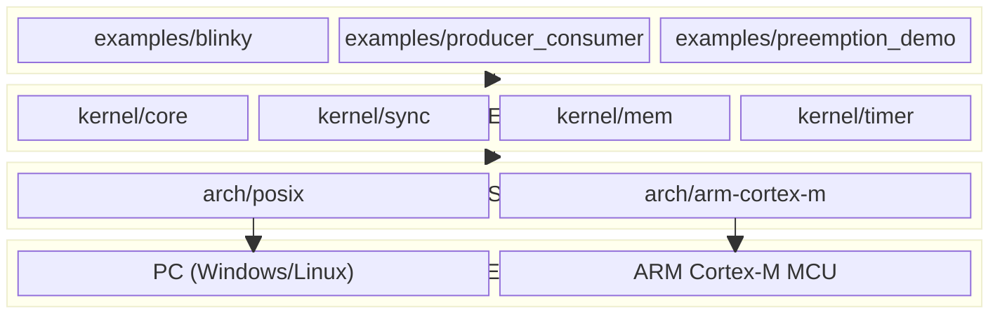
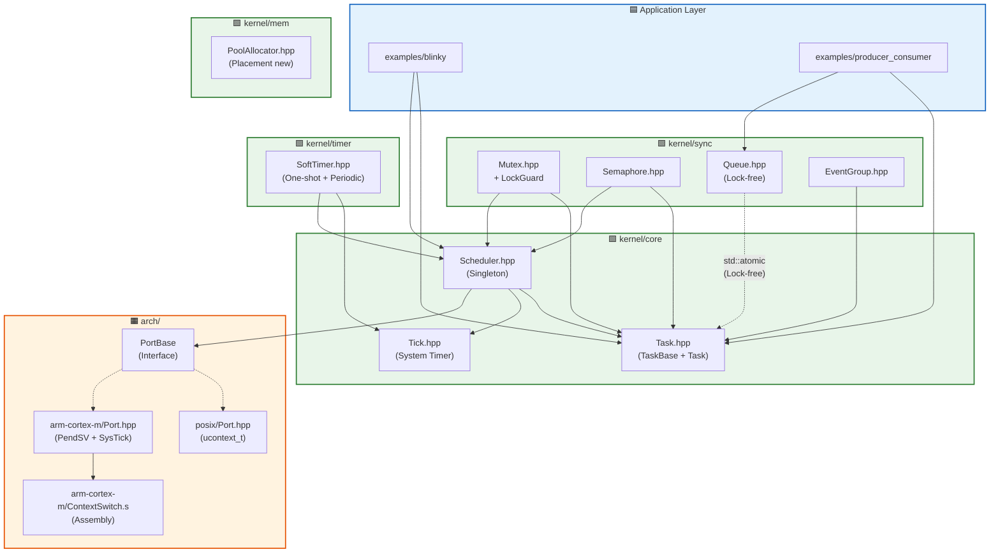
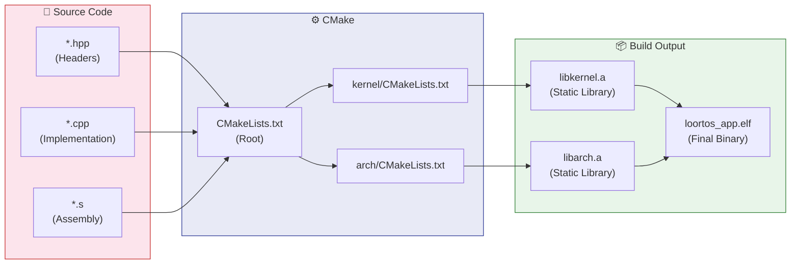

# 🧩 LooRTOS — Component Diagram

> Component diagrams describe the **physical module blocks** of the system  
> and how they **depend on each other** through interfaces.  
> This is the blueprint that maps directly to the project directory structure.

---

## 1. Layered Architecture Overview



---

## 2. Detailed Module Dependencies

> Arrow `A --> B` means A **depends on** B  
> (A needs to include headers or call functions from B to operate).



---

## 3. Project Directory Structure (UML → Code Mapping)

```
LooRTOS/
├── 📁 kernel/                        ← 🟩 KERNEL LAYER
│   ├── 📁 core/                      ← Central brain
│   │   ├── Task.hpp                  ← TaskBase + Task<N> (Type Erasure)
│   │   ├── Scheduler.hpp/.cpp        ← Singleton Scheduler
│   │   └── Tick.hpp/.cpp             ← System Tick Counter
│   │
│   ├── 📁 sync/                      ← Synchronization primitives
│   │   ├── Mutex.hpp/.cpp            ← Binary Mutex + Priority Inheritance
│   │   ├── LockGuard.hpp             ← RAII Wrapper for Mutex
│   │   ├── Semaphore.hpp/.cpp        ← Counting Semaphore
│   │   ├── Queue.hpp                 ← Template Lock-free Ring Buffer
│   │   └── EventGroup.hpp/.cpp       ← Event Flags
│   │
│   ├── 📁 mem/                       ← Static memory management
│   │   └── PoolAllocator.hpp         ← Object Pool (Placement new)
│   │
│   └── 📁 timer/                     ← Software timers
│       └── SoftTimer.hpp/.cpp        ← One-shot + Periodic Timer
│
├── 📁 arch/                          ← 🟧 HARDWARE ABSTRACTION LAYER
│   ├── 📁 posix/                     ← Simulation Port (Dev on PC)
│   │   ├── Port.hpp/.cpp             ← ucontext_t Context Switch
│   │   └── Tick.cpp                  ← POSIX timer simulates SysTick
│   │
│   └── 📁 arm-cortex-m/              ← Production Port (Real hardware)
│       ├── Port.hpp/.cpp             ← SysTick + NVIC Configuration
│       ├── ContextSwitch.s           ← PendSV Handler (ARM Assembly)
│       └── Startup.s                 ← Vector Table
│
├── 📁 examples/                      ← 🟦 APPLICATION LAYER
│   ├── blinky/                       ← LED Blink (Hello World of RTOS)
│   ├── producer_consumer/            ← Queue + 2 Tasks
│   └── preemption_demo/              ← Priority Preemption Demo
│
├── 📁 tests/                         ← ✅ Unit Tests (Google Test)
│
├── 📁 docs/                          ← 📚 Documentation
│   └── architecture/                 ← UML Diagrams (This file!)
│
├── 📁 scripts/                       ← 🔧 Build Scripts
│   ├── build.ps1                     ← PowerShell Build
│   └── build.sh                      ← Bash Build
│
└── CMakeLists.txt                    ← Root Build Configuration
```

---

## 4. Build Flow


