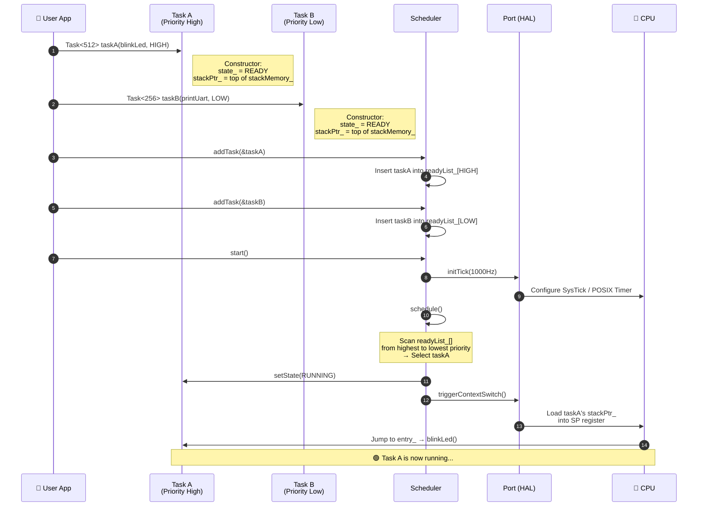
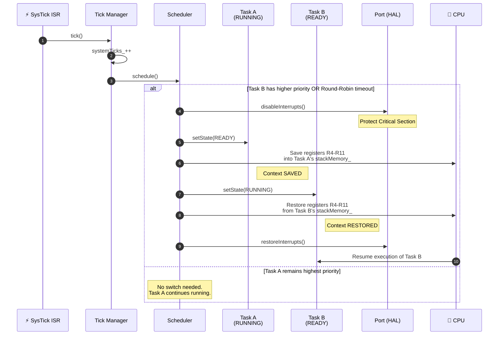
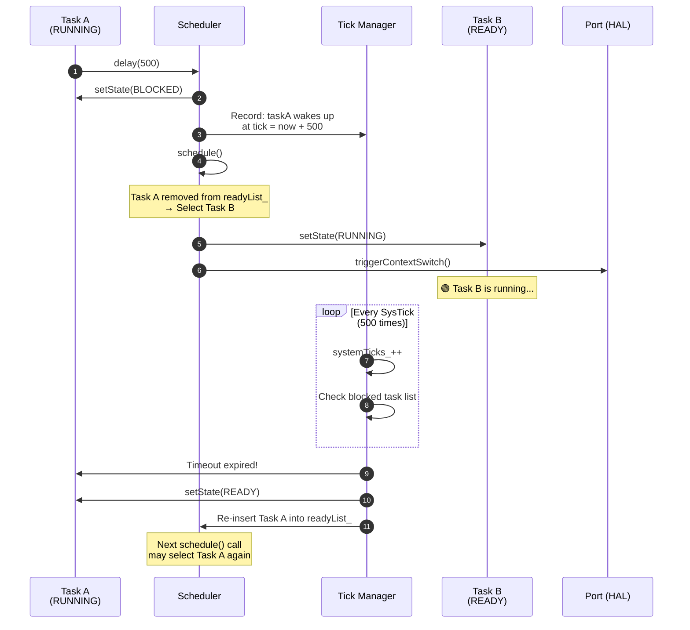
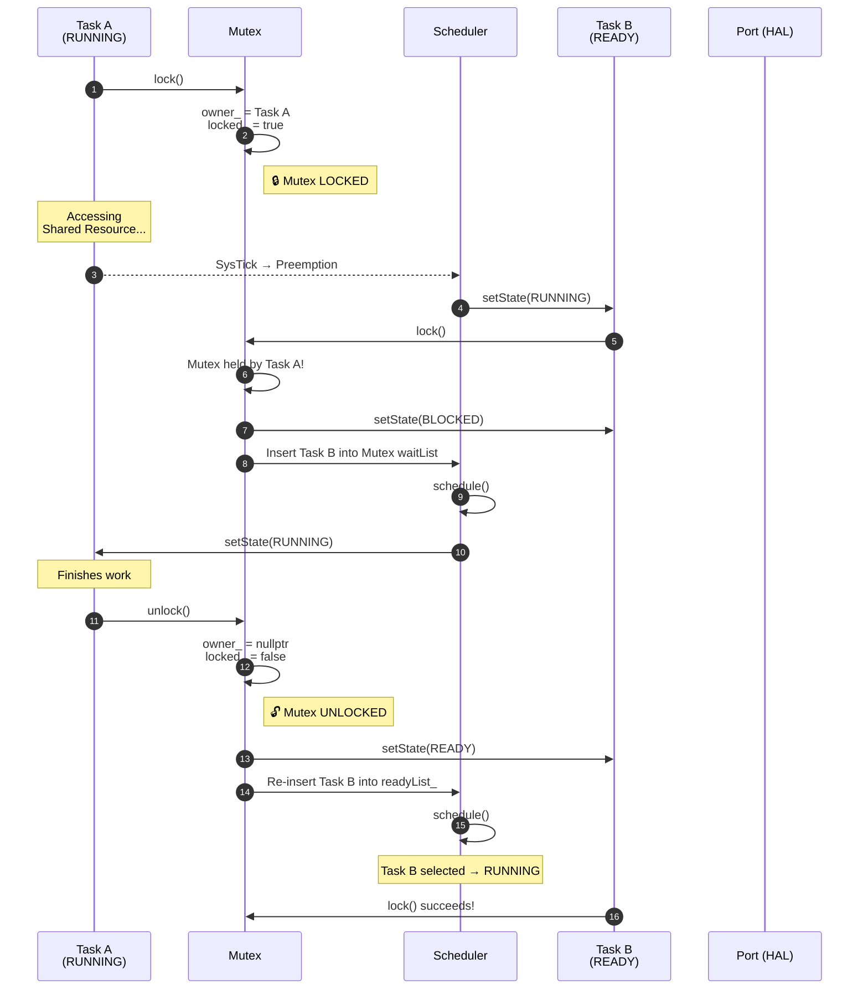
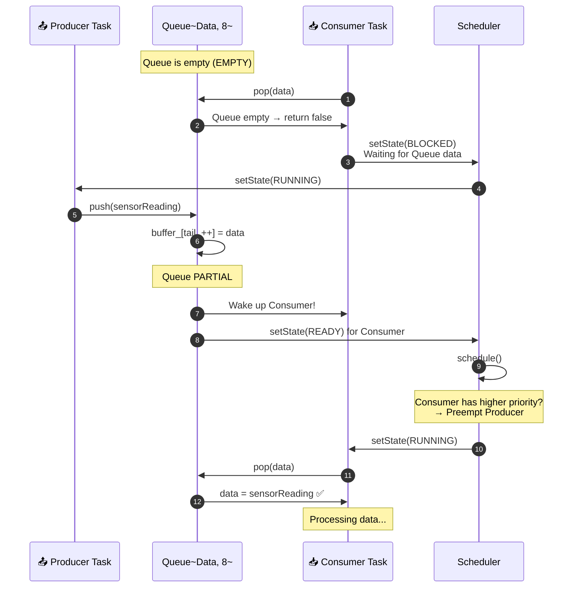

# 🔀 LooRTOS — Sequence Diagram

> Sequence diagrams describe the **interaction flow over time** between modules.  
> Read top-to-bottom = chronological order of events on the system.

---

## 1. System Boot Sequence

> Scenario: User creates 2 Tasks, then calls Kernel::start()  
> to begin multitasking.

---

## 2. Context Switch on Tick Interrupt

> Scenario: SysTick Interrupt fires every 1ms.  
> Scheduler checks whether a context switch is needed.

---

## 3. Task Calls delay() — Self-Blocking

> Scenario: Task A calls delay(500) to sleep for 500 ticks.

---

## 4. Mutex Lock/Unlock — Protecting Shared Resources

> Scenario: Task A locks a Mutex, Task B also wants to lock → BLOCKED.

---

## 5. Producer-Consumer via Queue

> Scenario: Producer Task pushes data into Queue,  
> Consumer Task pops data out for processing.

