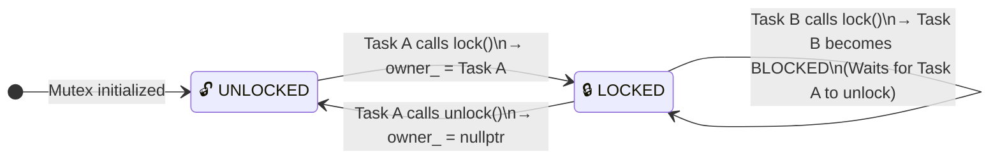
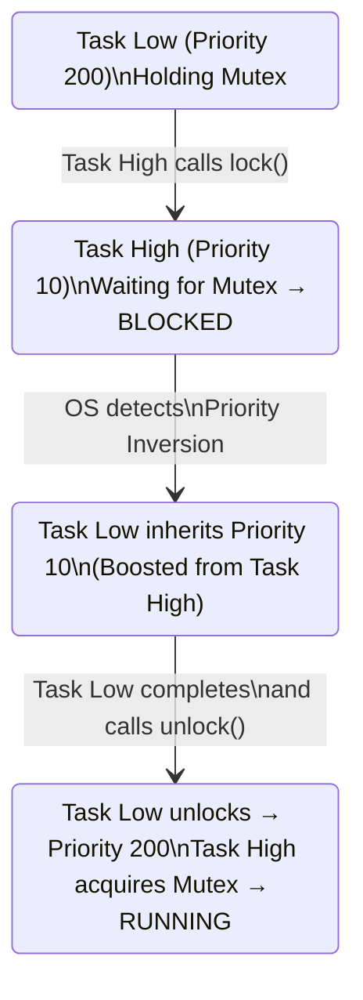
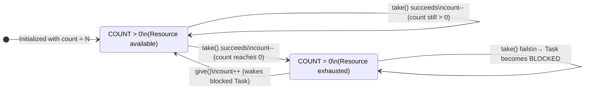
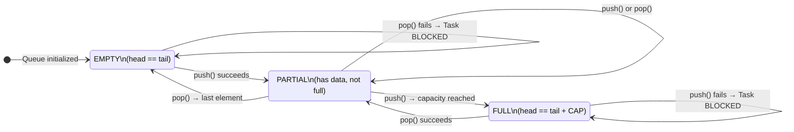
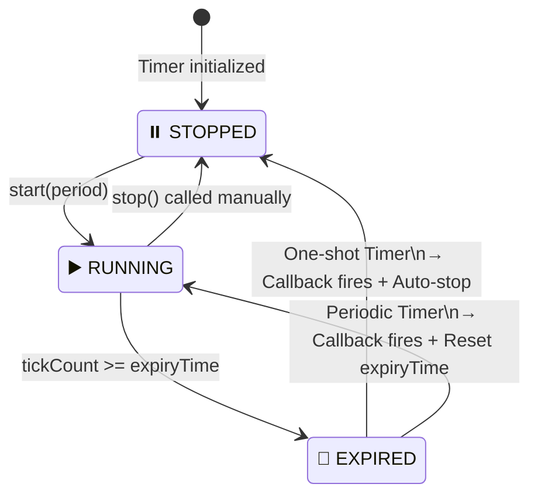

# 🔄 LooRTOS — State Machine Diagram

> State machine diagrams describe the **dynamic lifecycle** of entities in the system.  
> These diagrams are mandatory to understand before writing the Scheduler  
> to prevent **Race Conditions** and **Deadlocks**.

---

## 1. Task State Machine — Task Lifecycle

> This is the most critical state diagram in the entire RTOS.  
> The variable `volatile State currentState_` in `TaskBase` must follow  
> exactly the transitions (arrows) shown below.  
> Any transition NOT shown in this diagram is a **BUG**.

```mermaid
stateDiagram-v2
    direction TB

    [*] --> READY : Task created\n(Constructor complete)

    state "🟢 READY" as READY
    state "🔵 RUNNING" as RUNNING
    state "🔴 BLOCKED" as BLOCKED
    state "⚪ SUSPENDED" as SUSPENDED

    READY --> RUNNING : Scheduler::schedule()\nSelects highest priority Task

    RUNNING --> READY : Preempted by higher priority\nor Task calls yield()

    RUNNING --> BLOCKED : Task calls delay()\nor Mutex::lock() waits\nor Semaphore::take() waits\nor Queue::pop() empty

    BLOCKED --> READY : Timeout expired\nor Mutex unlocked\nor Semaphore::give()\nor Queue::push() has data

    RUNNING --> SUSPENDED : Task::suspend() called
    READY --> SUSPENDED : Task::suspend() called
    BLOCKED --> SUSPENDED : Task::suspend() called

    SUSPENDED --> READY : Task::resume() called
```

### ⚠️ Valid Transition Table

Cross-reference table — `✅` = Valid, `❌` = FORBIDDEN (If occurs = BUG)

| From ╲ To | READY | RUNNING | BLOCKED | SUSPENDED |
|-----------|-------|---------|---------|-----------|
| **READY** | ❌ | ✅ Scheduler | ❌ | ✅ suspend() |
| **RUNNING** | ✅ Preempt/Yield | ❌ | ✅ Wait/Delay | ✅ suspend() |
| **BLOCKED** | ✅ Event/Timeout | ❌ | ❌ | ✅ suspend() |
| **SUSPENDED** | ✅ resume() | ❌ | ❌ | ❌ |

> **Critical Note**: No transition goes **directly** to `RUNNING`.  
> Only the Scheduler has the authority to move a Task from `READY` → `RUNNING`.  
> A Task cannot run itself!

---

## 2. Mutex State Machine — Lock Lifecycle

> Mutex (Mutual Exclusion) ensures that only **one Task at a time**  
> can access a Shared Resource.



### Priority Inheritance Protocol



---

## 3. Semaphore State Machine — Signal Lifecycle



---

## 4. Queue State Machine — Buffer Lifecycle



---

## 5. SoftTimer State Machine — Timer Lifecycle


